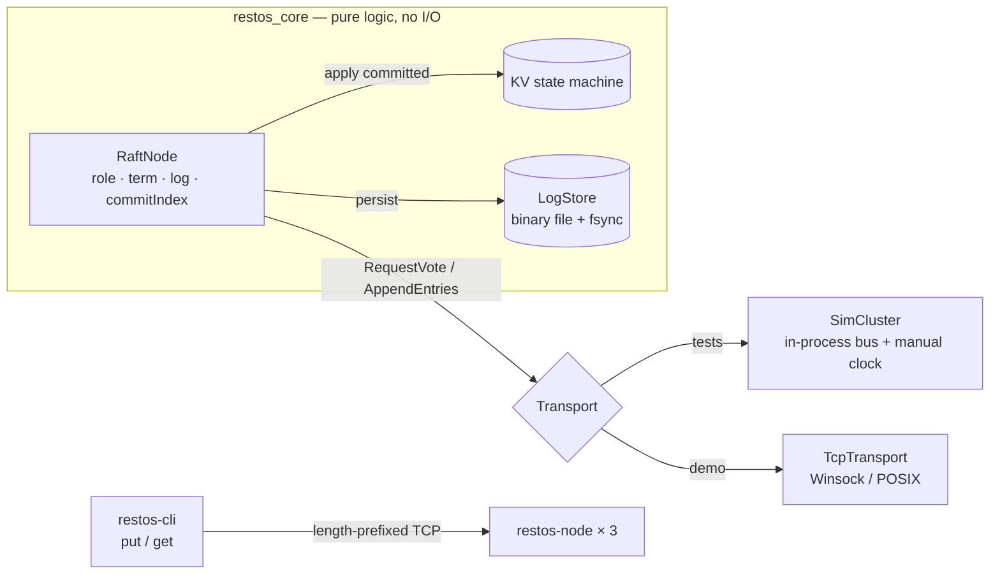

# restos-ledger

A Raft-replicated, append-only ledger with a key-value state machine, written in modern C++20 —
the durable, crash-safe log that would sit behind the RestOS restaurant system (orders, stock
moves). The consensus core is pure logic driven by an injected clock and message bus, so it's
tested deterministically; a thin TCP layer runs it as a real multi-node cluster.


[](https://github.com/arcsymer/restos-ledger/actions/workflows/ci.yml)


Demo evidence: [docs/demo.md](docs/demo.md) — a real 3-node cluster committing writes over TCP.

## Quickstart

Prerequisites: a **C++20 compiler** (GCC 12+/Clang 15+/MSVC 2022), **CMake 3.20+**, and a
generator (**Ninja** recommended, or Make). GoogleTest is fetched automatically. Nothing else —
no accounts, no services.

```sh
git clone https://github.com/arcsymer/restos-ledger && cd restos-ledger
cmake -S . -B build -G Ninja        # omit -G Ninja to use your default generator
cmake --build build
ctest --test-dir build --output-on-failure   # 8 tests: election, replication, crash-restart, …
```

Run a real 3-node cluster and talk to it:

```sh
scripts/cluster.sh                  # Windows: scripts\cluster.ps1   (boots ports 5000-5002)
build/restos-cli --nodes 127.0.0.1:5000,127.0.0.1:5001,127.0.0.1:5002 put order:42 "2x zurek"
build/restos-cli --nodes 127.0.0.1:5000,127.0.0.1:5001,127.0.0.1:5002 get order:42
```

## Architecture



The Raft node never touches a socket or the wall clock — time comes from `tick(now_ms)` and
messages from `receive()`. That's what makes it deterministically testable; the TCP transport and
the CLI are a thin shell around the same core.

## Features

1. **Append-only log + KV state machine** — binary on-disk format; `put`/`del` applied from
   committed entries; `currentTerm`, `votedFor`, and `commitIndex` persisted (crash-safe).
2. **Leader election** — terms, `RequestVote`, randomized timeouts, step-down on a higher term.
3. **Log replication** — `AppendEntries` with log-matching + conflict truncation; commit by
   majority; apply to the state machine.
4. **Deterministic simulation harness** — an in-process bus + manual clock (`SimCluster`) with
   crash/partition injection: the substrate for the consensus tests.
5. **TCP transport + 3-node cluster** — length-prefixed framing over Winsock/POSIX sockets;
   `scripts/cluster.{sh,ps1}` boot a local cluster.
6. **CLI client** — `restos-cli put/get`, following the leader via a REDIRECT hint.
7. **Tested + sanitized** — 8 GoogleTest cases; CI builds with **GCC and Clang**, runs the suite
   under **AddressSanitizer and ThreadSanitizer**, enforces a **-Werror** warning-clean build,
   and includes a **Windows MinGW** job + gitleaks.

## Testing & CI

```sh
ctest --test-dir build --output-on-failure           # the suite
cmake -S . -B asan -DRESTOS_SANITIZE=ON && cmake --build asan && ctest --test-dir asan   # ASan
cmake -S . -B tsan -DRESTOS_TSAN=ON && cmake --build tsan && ctest --test-dir tsan       # TSan
```

## Limitations

- **MVP Raft:** no log snapshotting/compaction and no dynamic membership changes (both v2). Reads
  are served by the leader; there's no lease-based read optimization.
- **Single-threaded node:** the demo server uses one `select()` loop with blocking peer connects,
  so a peer that is *hung* (not cleanly down) can briefly stall it — fine for a local demo, but a
  production node would use non-blocking peer I/O (v2). Fault-tolerance/safety properties are
  proven by the deterministic tests, not by racing real sockets.
- Synthetic, single-cluster, local only; the on-disk format is host-endian (per-node local).

## v2 ideas

Snapshotting + compaction; dynamic membership; pre-vote; leadership-lease reads; non-blocking
peer I/O; a mmap-backed log.

## License & attribution

MIT — see [LICENSE](LICENSE). Part of the [RestOS](https://github.com/arcsymer) portfolio.

Built end-to-end with an agentic workflow (Claude Code), orchestrated, reviewed, and directed by me.
